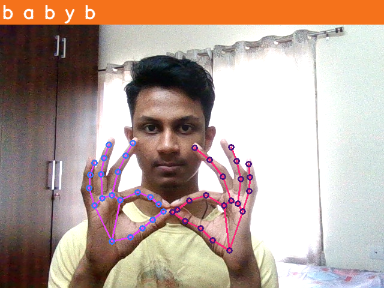

# Sign-Lang-Detection
This is an LSTM model made to transcribe Indian Sign Language to English text. 

### Output

# Tech used
- Tensorflow
- Mediapipe
- OpenCV

# To run
Install the dependencies and run the test.py file.
